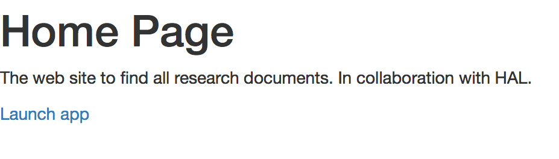

# Search Tiger

Projet pour le module *Personnalisation et Systèmes de Recommandation*. Équipe composée de Esteban Gobert et Mélissa L'Hénoret.

## Installation
1. Installez ElasticSearch
2. Installez Node.js
3. Installez un navigateur web récent

## Exécution
1. Lancez ElasticSearch. (ElasticSearch nécessite d'ouvrir l'accès au port 9200)
2. Dans un terminal, placez-vous à la racine du projet
3. Exécutez les commandes suivantes :

```bash
$ npm install # installe les dépendances Node.js
$ node server.js # lance le serveur sur le port 8443
```

4. Dans votre navigateur, rendez-vous à l'adresse suivante (le site utilisant un certificat auto-signé, pensez à l'accepter) `https://localhost:8443`

5. Cliquez sur le lien "se connecter" pour lancer l'application :



6. Créez un compte, ou utilisez le compte existant :

```
utilisateur : mel
mot de passe : mel
```

7. Ajoutez des données dans la base de données en utilisant les champs suivants :



Nous vous conseillons de réaliser les requêtes sur les co-auteurs suivants :

- Mohamed Quafafou
- Bernard Espinasse

8. Cliquez sur le bouton search by similar author ou rendez-vous à l'adresse `https://localhost:8443/#!/similar`

9. Vous pouvez cherchez les auteurs similaires (présent dans la base de donnée) à un auteur donné (attention à la casse) en utilisant le champ suivant :


Nous vous conseillons de réaliser les requêtes suivantes :

- Nicolas Durand : L'auteur Mohamed Quafafou doit apparaitre dans la liste
- Erwan Tranvouez : L'auteur Bernard Espinasse doit apparaitre dans la liste

## Information complémentaire

Pour vider la base de données ElastricSearch, exécutez la commande suivante dans un terminal :

```bash
$ curl -XDELETE "http://localhost:9200/*"
```
